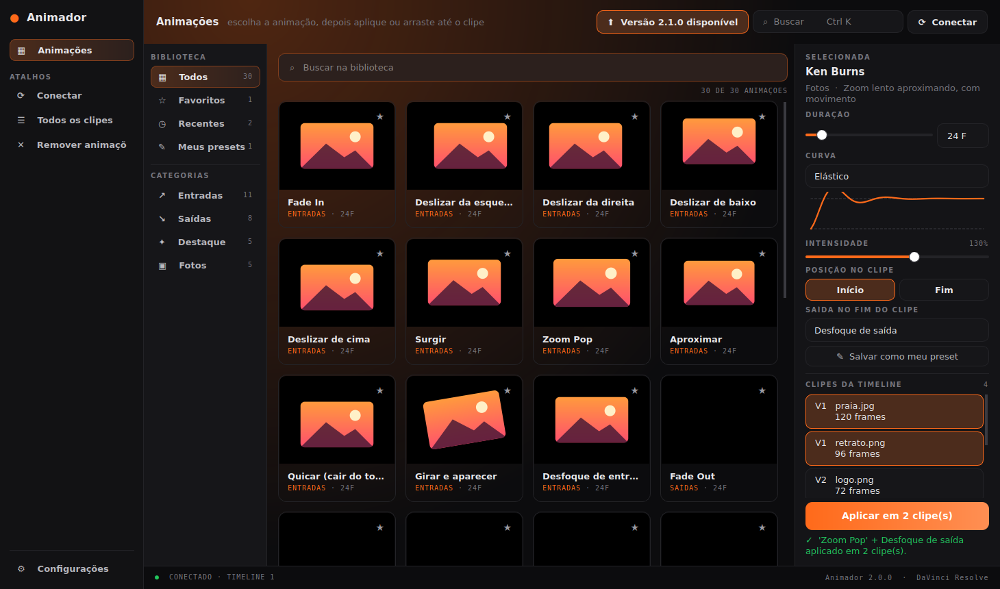

# Animador para DaVinci Resolve

Biblioteca de animações prontas para **imagens** no DaVinci Resolve: escolha a
animação, veja a prévia ao vivo e aplique em vários clipes da timeline de uma vez.

Existem duas formas de usar:

- **Animador App**: programa com janela própria que se conecta ao DaVinci e
  anima os clipes da timeline. Precisa do **DaVinci Resolve Studio**.
- **Script no DaVinci** (`Animador.py`): janela simples dentro do DaVinci que
  anima o nó selecionado na página Fusion. Funciona também na versão gratuita.

## Animações (29)

| Categoria | Animações |
| --- | --- |
| Entradas | Fade In, Deslizar da esquerda / direita / de baixo / de cima, Surgir, Zoom Pop, Aproximar, Quicar, Girar e aparecer, Desfoque de entrada |
| Saídas | Fade Out, Sair pela esquerda / direita / por baixo / por cima, Encolher, Girar e sumir, Desfoque de saída |
| Destaque | Pulsar, Respirar, Balançar, Tremer, Piscar |
| Fotos | Ken Burns, Ken Burns (afastar), Panorâmica para a esquerda / direita / para cima |

Em todas dá para ajustar:

- **Duração** em frames.
- **Curva**: Linear, Suave, Desacelerar, Acelerar, Voltar, Elástico ou Quique,
  com gráfico mostrando o formato.
- **Intensidade** de 25% a 200%: quanto desliza, cresce, gira ou desfoca.
- **Posição**: início ou fim do clipe.
- **Saída no fim do clipe**: entrada + saída com um clique só.

## Animador App

### Instalar

**Jeito fácil (recomendado):** baixe o **`Animador-Instalador.exe`** (ou o
`Animador.exe`, que não precisa instalar) na aba **Actions** ou **Releases** do
GitHub. Não precisa de Python.

Se o Windows mostrar "O Windows protegeu o computador", clique em
**Mais informações → Executar assim mesmo** (o app não tem assinatura digital paga).

**Pelo código-fonte:** instale o Python 3 (marque "Add python.exe to PATH") e dê
dois cliques em `Abrir Animador.bat`, que instala o PySide6 na primeira vez.

### Preparar o DaVinci (só uma vez)

No DaVinci Resolve Studio, abra **Preferences → System → General**, mude
**External scripting using** para **Local** e reinicie o DaVinci.

### Usar

1. Abra o DaVinci com a timeline que tem as imagens.
2. Abra o Animador e clique em **Conectar** (ou **F5**).
3. Escolha a animação nos cartões (filtre por categoria ou busque).
4. Ajuste duração, curva, intensidade e posição no painel da direita.
5. Selecione os clipes e clique em **Aplicar**, ou **arraste o cartão** até um
   clipe da lista.

Cada clipe ganha uma composição Fusion com a animação. Para tirar, selecione os
clipes e use **Limpar clipes**: só os nós criados pelo Animador são removidos.

### Como a animação fica no Fusion

Cada animação vira **um nó só**, logo depois da imagem:

- **Transform** para movimento, tamanho e rotação. A curva (Elástico, Quique,
  Suave...) vem de um modificador **AnimCurves**, guiado por uma rampa de tempo
  com apenas dois keyframes lineares. Para mudar a duração depois, basta mover
  esses dois keyframes no Spline.
- **BrightnessContrast** para Fade e Piscar (o Transform não tem opacidade).
- **Blur** para desfoque.

As animações que juntam movimento e opacidade (Surgir, Aproximar) ou desfoque
e opacidade (Desfoque de entrada/saída) usam dois nós. As oscilações (Pulsar,
Respirar, Balançar, Tremer, Piscar) usam keyframes, porque o AnimCurves não faz
ida e volta.

### Recursos

- **Favoritos** (★), **Recentes** e **Meus presets** (salve uma animação com
  suas configurações: botão "Salvar como meu preset" ou Ctrl+S). Clique com o
  botão direito num cartão para mais opções.
- **Temas** claro e escuro e **cor de destaque** em Configurações.
- Lembra as últimas configurações entre uma sessão e outra.
- Avisa quando sai uma versão nova (precisa que o repositório seja público).

### Atalhos

| Tecla | Ação |
| --- | --- |
| Ctrl+K ou Ctrl+F | Buscar |
| Ctrl+Enter | Aplicar nos clipes selecionados |
| F5 | Conectar / atualizar clipes |
| Ctrl+S | Salvar como meu preset |
| Esc | Limpar a busca |

## Script no DaVinci

Copie `Animador.py` para a pasta de scripts do Fusion:

- **Windows:** `%APPDATA%\Blackmagic Design\DaVinci Resolve\Support\Fusion\Scripts\Comp\`
- **macOS:** `~/Library/Application Support/Blackmagic Design/DaVinci Resolve/Fusion/Scripts/Comp/`
- **Linux:** `~/.local/share/DaVinciResolve/Fusion/Scripts/Comp/`

Reinicie o DaVinci. Na página **Fusion**, selecione o nó da imagem (`MediaIn1`)
e abra **Workspace → Scripts → Comp → Animador**. Escolha a animação, a curva,
o frame inicial e a duração e clique em **Aplicar**. **Remover animações** tira
os nós criados pelo Animador. **Ctrl+Z** desfaz.

## Para desenvolvedores

| Arquivo | O que é |
| --- | --- |
| `Animador.py` | Motor: presets, curvas, keyframes e nós do Fusion (também roda como script dentro do DaVinci) |
| `AnimadorApp.py` | Conexão com o DaVinci, aplicação nos clipes e busca de atualizações |
| `interface.py` | Janela (PySide6) |
| `Animador.spec` | Receita do PyInstaller para o `.exe` |
| `instalador/Animador.iss` | Instalador (Inno Setup) |
| `.github/workflows/build-windows.yml` | Gera o `.exe` e o instalador a cada push |

Testes: `python -m unittest discover tests`

Para publicar uma versão: mude `VERSAO` em `AnimadorApp.py` e crie uma tag
`v<versão>` (ex.: `v2.0.0`). O GitHub Actions publica o `.exe` e o instalador
em **Releases**, e o app avisa quem estiver com a versão antiga.
